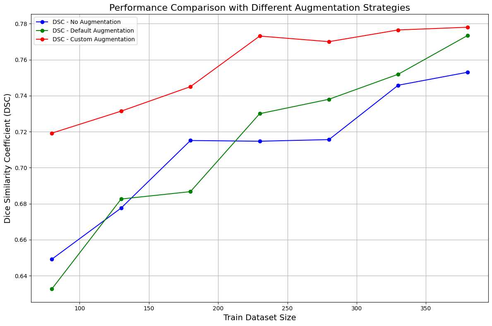
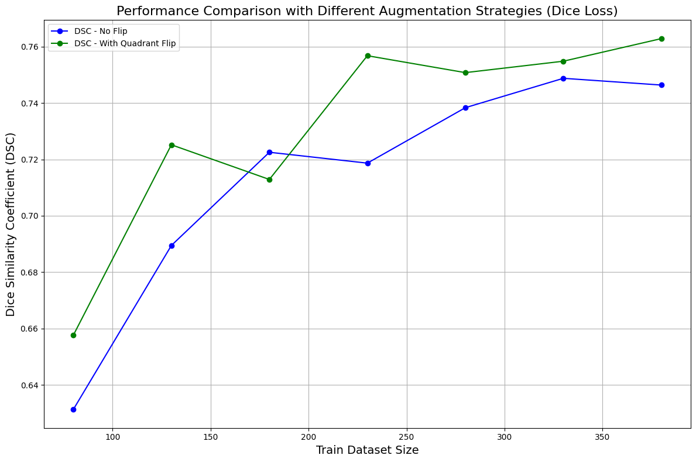

# 4xRay: Advanced Dental Diagnosis for Panoramic X-rays

This repository contains enhancements to the winning algorithm from the [MICCAI 2023 Dentex Challenge](https://dentex.grand-challenge.org/). For in-depth information, please refer to the winner's paper: [Integrated Segmentation and Detection Models for Dentex Challenge 2023](https://arxiv.org/abs/2308.14161).

## Table of Contents
- [Setup](#setup)
  - [Create a Conda Environment](#create-a-conda-environment)
  - [Install PyTorch](#install-pytorch)
  - [Install Additional Requirements](#install-additional-requirements)
  - [Build MultiScaleDeformableAttention](#build-multiscaledeformableattention)
- [Prepare Detection & Segmentation Dataset](#prepare-detection--segmentation-dataset)
- [Training](#training)
  - [Download Pretrained Weights](#download-pretrained-weights)
  - [Train DiffusionDet for Quadrant Detection](#train-diffusiondet-for-quadrant-detection)
  - [Train DINO res50](#train-dino-res50)
  - [Train DINO swin](#train-dino-swin)
  - [Transfer DINO swin to Train Disease Detection](#transfer-dino-swin-to-train-disease-detection)
  - [Continue Training on Full Disease Dataset](#continue-training-on-full-disease-dataset)
  - [Train YOLOv8 for Disease Detection](#train-yolov8-for-disease-detection)
  - [Train U-Net for Enumeration32](#train-u-net-for-enumeration32)
  - [Train U-Net for Enumeration9](#train-u-net-for-enumeration9)
- [Prediction](#prediction)
- [Bilateral Symmetry Data Augmentation](#bilateral-symmetry-data-augmentation)
  - [Process](#process)
  - [Comparison](#comparison)
  - [Results](#results)
- [Quadrant Symmetry Data Augmentation](#quadrant-symmetry-data-augmentation)
  - [Process](#process-1)
  - [Comparison](#comparison-1)
  - [Results](#results-1)

## Setup

### Create a Conda Environment
```sh
conda create -n sd python=3.10
conda activate sd
```

### Install PyTorch
```sh
pip3 install torch torchvision torchaudio  # for CUDA 12.1
```

### Install Additional Requirements
```sh
pip install addict yapf timm scipy pycocotools termcolor opencv-python SimpleITK fvcore cloudpickle omegaconf ultralytics tensorboard
```

### Build MultiScaleDeformableAttention
```sh
cd models/dino/ops
export TORCH_CUDA_ARCH_LIST="7.5;8.6"  # 7.5 for grand-challenge's online GPU (T4), 8.6 for 3090
python setup.py install
cd ../../../..
```

## Prepare Detection & Segmentation Dataset

Run each `process...` function in `process_dataset.py` to convert the dataset into the required format (COCO or YOLO) for detection models and 32-class or 9-class segmentation masks for segmentation models. 

- The 32-class segmentation dataset can be generated from the original dataset.
- The 9-class segmentation dataset depends on predictions by a quadrant detection model. See `results/enumeration_dataset_quadrant_predictions.json` for an example.

The processes should be executed sequentially.

## Training

1. **Download Pretrained Weights**

   Download pretrained weights from the official repositories (Swin Transformer, DINO, YOLO, etc.) and place them in the `checkpoints` folder.

    - [swin_base_patch4_window7_224_22k.pkl](https://github.com/ShoufaChen/DiffusionDet/releases/download/v0.1/swin_base_patch4_window7_224_22k.pkl)
    - [dino_pretrained_checkpoint0029_4scale_swin.pth](https://drive.google.com/drive/folders/1qD5m1NmK0kjE5hh-G17XUX751WsEG-h_)
    - [dino_pretrained_checkpoint0033_4scale.pth](https://drive.google.com/drive/folders/1qD5m1NmK0kjE5hh-G17XUX751WsEG-h_)
    - [yolov8x.pt](https://github.com/ultralytics/assets/releases/download/v8.2.0/yolov8x.pt)

2. **Train DiffusionDet for Quadrant Detection**
    ```sh
    python train_diffdet.py \
        --output-dir outputs/output_diffdet_quadrant \
        --config-file configs/diffdet/diffdet.dentex.swinbase.quadrant.yaml \
        MODEL.WEIGHTS checkpoints/swin_base_patch4_window7_224_22k.pkl
    ```

3. **Train DINO res50**
    ```sh
    python train_dino.py \
        --output_dir outputs/output_dino_res50_enum32 -c configs/dino/DINO_4scale_cls32.py --coco_path dentex_dataset/coco/enumeration32 \
        --options dn_scalar=100 embed_init_tgt=TRUE \
        dn_label_coef=1.0 dn_bbox_coef=1.0 use_ema=False \
        dn_box_noise_scale=1.0 \
        --pretrain_model_path checkpoints/dino_pretrained_checkpoint0033_4scale.pth --finetune_ignore label_enc.weight class_embed
    ```

4. **Train DINO swin**
    ```sh
    python train_dino.py \
        --output_dir outputs/output_dino_swin_enum32 -c configs/dino/DINO_4scale_swin_cls32.py --coco_path dentex_dataset/coco/enumeration32 \
        --options dn_scalar=100 embed_init_tgt=TRUE \
        dn_label_coef=1.0 dn_bbox_coef=1.0 use_ema=False \
        dn_box_noise_scale=1.0 \
        --pretrain_model_path checkpoints/dino_pretrained_checkpoint0029_4scale_swin.pth --finetune_ignore label_enc.weight class_embed
    ```

5. **Transfer DINO swin to Train Disease Detection**
    ```sh
    python train_dino.py \
        --output_dir outputs/output_dino_swin_disease -c configs/dino/DINO_4scale_swin_cls4.py --coco_path dentex_dataset/coco/disease \
        --options dn_scalar=100 embed_init_tgt=TRUE \
        dn_label_coef=1.0 dn_bbox_coef=1.0 use_ema=False \
        dn_box_noise_scale=1.0 \
        --pretrain_model_path output_dino_swin_enum32/checkpoint0020.pth --finetune_ignore label_enc.weight class_embed
    ```

6. **Continue Training on Full Disease Dataset**
    ```sh
    python train_dino.py \
        --output_dir outputs/output_dino_swin_disease_all -c configs/dino/DINO_4scale_swin_cls4.py --coco_path dentex_dataset/coco/disease_all \
        --options dn_scalar=100 embed_init_tgt=TRUE \
        dn_label_coef=1.0 dn_bbox_coef=1.0 use_ema=False \
        dn_box_noise_scale=1.0 \
        --resume output_dino_swin_disease/checkpoint0017.pth
    ```

7. **Train YOLOv8 for Disease Detection**
    ```sh
    python train_yolo.py  # modify configs in train_yolo.py and config/yolo/
    ```

8. **Train U-Net for Enumeration32**
    ```sh
    python train_unet.py \
        --output_dir output_unet_enum32_16 \
        --dataset_dir dentex_dataset/segmentation/enumeration32 \
        --num_classes 32 --model seunet --batch_size 16
    ```

9. **Train U-Net for Enumeration9**
    ```sh
    python train_unet.py \
        --output_dir output_unet_enum9_16 \
        --dataset_dir dentex_dataset/segmentation/enumeration9 \
        --num_classes 9 --model seunet --batch_size 16
    ```

## Prediction

Select the best checkpoints for each model, rename them or adjust the paths in predict.py, and run the script. results/abnormal-teeth-detection.json provides an example output.

## Bilateral Symmetry Data Augmentation

We propose a novel method to expand the dataset to four times its original size using bilateral symmetry augmentation.

### Process

1. **Process Quadrant Segmentation Dataset**
    Run process_seg_quadrant.py in the bilateral_symmetry_augmentation folder to generate a quadrant dataset for segmentation in dentex_dataset/segmentation/quadrant.

2. **Train U-Net for Quadrant Segmentation**
    ```sh
    python train_unet.py \
        --output_dir outputs/output_unet_quadrant_16 \
        --dataset_dir dentex_dataset/segmentation/quadrant \
        --num_classes 4 --model seunet --batch_size 16
    ```

3. **Generate Augmented Dataset**
    Run `data_augmentation_all.py` in the `bilateral_symmetry_augmentation` folder to create a new dataset in `dentex_dataset/segmentation/enumeration32_bilateral_symmetry_augmentation_all`. This new dataset will have four times more images and masks compared to `dentex_dataset/segmentation/enumeration32`.

4. **Train U-Net on Augmented Dataset**

### Comprehensive Analysis

1. **Split the Dataset**
    Run `split_train_val_test.py` in the `bilateral_symmetry_augmentation` folder to split the enumeration32 segmentation dataset into train (380), validation (127), and test (127) sets. Ignore if this is already done. This split dataset will be saved in `dentex_dataset/segmentation/enumeration32_train_val_test`.

2. **Generate Training Segments**
    Split the train set into segments starting from 80, adding 50 randomly to create the next segment by running `split_train.py` in the `bilateral_symmetry_augmentation` folder. This will produce `train_80`, `train_130`, `train_180`, `train_230`, `train_280`, `train_330`, and `train_380`. Ignore if this is already done. These segments will be saved in the same directory.

3. **Generate Augmented Data for Each Segment**
    Run `data_augmentation_train_range.py` in the `bilateral_symmetry_augmentation` folder to generate augmented data for each training segment. This data will be saved in `dentex_dataset/segmentation/enumeration32_bilateral_symmetry_augmentation`.

4. **Train U-Net on Each Segment**
    Run `training_32.sh` in the `bilateral_symmetry_augmentation` folder to train U-Net on each segment.

5. **Test U-Net**
    Run `testing_32.sh` in the `bilateral_symmetry_augmentation` folder to test U-Net on the best checkpoint of each segment.

### Results

The DSC (Dice Similarity Coefficient) comparison of Bilateral Symmetry Augmentation is illustrated below:



## Quadrant Symmetry Data Augmentation

We propose a novel method to flip the quadrants to help improve the model.

### Process

1. **Generate Augmented Dataset**
    Run `data_augmentation_all.py` in the `quadrant_symmetry_augmentation` folder to create a new dataset in `dentex_dataset/segmentation/enumeration9_quadrant_symmetry_augmentation_all`. This new dataset will have flipped quadrants to match the first quadrant.

2. **Train U-Net on Augmented Dataset**

### Comprehensive Analysis

1. **Split the Dataset**
    Run `split_train_val_test.py` in the `bilateral_symmetry_augmentation` folder to split the enumeration32 segmentation dataset into train (380), validation (127), and test (127) sets. Ignore if this is already done. This split dataset will be saved in `dentex_dataset/segmentation/enumeration32_train_val_test`.

2. **Generate Training Segments**
    Split the train set into segments starting from 80, adding 50 randomly to create the next segment by running `split_train.py` in the `bilateral_symmetry_augmentation` folder. This will produce `train_80`, `train_130`, `train_180`, `train_230`, `train_280`, `train_330`, and `train_380`. Ignore if this is already done. These segments will be saved in the same directory.

3. **Generate Augmented Data for Each Segment, Val, and Test**
    Run `data_augmentation_train_range_val_test.py` in the `quadrant_symmetry_augmentation` folder to generate augmented data for each training segment, including validation and test sets. This data will be saved in `dentex_dataset/segmentation/enumeration9_quadrant_symmetry_augmentation`.

4. **Train U-Net on Each Segment**
    Run `training_9.sh` in the `quadrant_symmetry_augmentation` folder to train U-Net on each segment.

5. **Test U-Net**
    Run `testing_9.sh` in the `quadrant_symmetry_augmentation` folder to test U-Net on the best checkpoint of each segment.

### Results

The DSC comparison of Quadrant Symmetry Augmentation is illustrated below:


